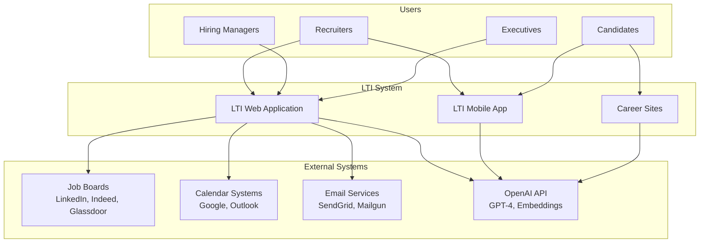
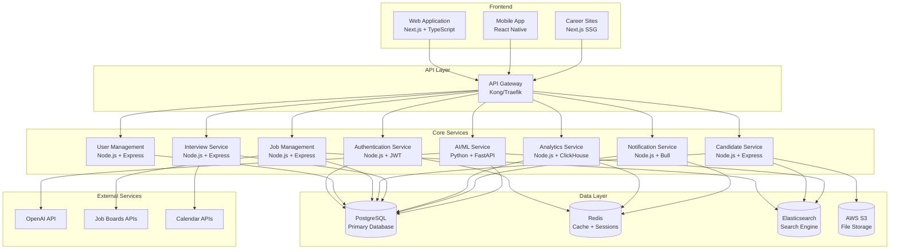

# LTI-DCGC
## Sistema ATS (Applicant Tracking System) del Futuro

---

## 📋 Tabla de Contenidos

1. [Recomendaciones Estratégicas](#recomendaciones-estratégicas)
2. [Descripción del Software LTI](#descripción-del-software-lti)
3. [Lean Canvas](#lean-canvas)
4. [Casos de Uso Principales](#casos-de-uso-principales)
5. [Modelo de Datos](#modelo-de-datos)
6. [Diseño del Sistema a Alto Nivel](#diseño-del-sistema-a-alto-nivel)
7. [Diagrama C4 - Componente de IA](#diagrama-c4---componente-de-ia)

---

## 🎯 Recomendaciones Estratégicas

### Mercado Objetivo Inicial
**PYMES en crecimiento (50-500 empleados)**
- Segmento de mayor crecimiento con +73% invirtiendo en automatización para 2025
- Presupuestos flexibles y ciclos de venta rápidos (3-6 meses)
- Necesidades reales de ATS pero limitaciones con soluciones enterprise costosas

### Estrategia de Expansión Global
**Plan de 3 fases:**
1. **Fase 1**: Latinoamérica (ventaja cultural/idioma)
2. **Fase 2**: Norteamérica (92.4% del mercado actual)
3. **Fase 3**: Europa y Asia-Pacífico

### Competidores y Oportunidades
**Líderes actuales**: Workday, BambooHR, Greenhouse, iCIMS, Oracle Taleo
**Oportunidades identificadas**:
- Interfaces poco modernas
- Complejidad excesiva para PYMES
- IA limitada o como add-on costoso
- Poca personalización regional

### Stack Tecnológico MVP
- **Frontend**: Next.js 15 + TypeScript + Tailwind CSS
- **Backend**: Node.js + NestJS + TypeScript
- **Base de Datos**: PostgreSQL (managed)
- **Cloud**: Vercel/Railway + AWS/GCP
- **IA**: OpenAI API + Langchain

### Modelo de Negocio
**Freemium + Seat-based SaaS:**
- **Free**: 1 trabajo activo, 50 candidatos/mes
- **Starter**: $25/mes - 5 trabajos, IA básica
- **Professional**: $75/mes - Trabajos ilimitados, IA avanzada
- **Enterprise**: $150+/mes - White-label, integraciones custom

---

## 🚀 Descripción del Software LTI

### Visión
LTI es el **ATS del futuro** que democratiza el acceso a tecnología de reclutamiento de clase mundial para PYMES en crecimiento. Combinamos **IA nativa**, **experiencia de usuario superior** y **precios accesibles** para revolucionar cómo las empresas encuentran y contratan talento.

### Propuesta de Valor
**"Contrata 3x más rápido, con 60% menos costo y mejor calidad de candidatos"**

### Ventajas Competitivas Clave

#### 1. **IA Nativa desde el Día 1**
- **CV Parsing inteligente** con 98% de precisión
- **Candidate Scoring** automático basado en criterios customizables
- **Bias Detection** para contratación inclusiva
- **Predictive Analytics** para retención de empleados

#### 2. **Experiencia de Usuario Superior**
- **Onboarding de 5 minutos** vs 2-4 semanas de competidores
- **Mobile-first design** para reclutadores en movimiento
- **UI/UX moderna** inspirada en Figma/Linear/Notion
- **Colaboración en tiempo real** entre equipos

#### 3. **Pricing Disruptivo**
- **60% más barato** que soluciones enterprise
- **Sin costos de setup** o implementación
- **Escalamiento transparente** sin sorpresas
- **ROI visible** desde el primer mes

#### 4. **Tecnología de Vanguardia**
- **API-first architecture** para integraciones ilimitadas
- **Real-time collaboration** con WebSockets
- **Advanced analytics** con dashboards ejecutivos
- **White-label ready** para agencias

### Funciones Principales

#### 🎯 **Gestión de Vacantes Inteligente**
- **Job Description Optimizer**: IA que mejora descripciones para atraer mejor talento
- **Multi-channel Publishing**: Publica en +50 job boards con un clic
- **Smart Targeting**: Algoritmos que identifican dónde encontrar candidatos ideales
- **Performance Analytics**: Métricas en tiempo real de efectividad por canal

#### 🤖 **Screening Automatizado con IA**
- **Resume Parsing**: Extrae y estructura información de CVs automáticamente
- **Candidate Matching**: Puntúa candidatos vs requisitos del puesto
- **Video Screening**: Análisis de entrevistas grabadas con IA
- **Bias Detection**: Identifica y previene sesgos inconscientes

#### 👥 **Colaboración en Tiempo Real**
- **Shared Pipelines**: Equipos trabajando simultáneamente en candidatos
- **Live Comments**: Feedback instantáneo en perfiles de candidatos
- **Approval Workflows**: Procesos customizables por rol/departamento
- **Calendar Integration**: Coordinación automática de entrevistas

#### 📊 **Analytics y Reportes Avanzados**
- **Executive Dashboards**: KPIs para liderazgo (time-to-hire, cost-per-hire, quality scores)
- **Recruiter Performance**: Métricas individuales y de equipo
- **Pipeline Analytics**: Identificación de cuellos de botella
- **Predictive Insights**: Pronósticos de contratación basados en datos históricos

#### 🔄 **Automatizaciones Inteligentes**
- **Email Sequences**: Comunicación automatizada con candidatos
- **Interview Scheduling**: Coordinación inteligente de calendarios
- **Reference Checks**: Automatización de verificación de referencias
- **Onboarding Triggers**: Activación automática de procesos post-contratación

#### 🌐 **Candidate Experience Premium**
- **Career Sites**: Páginas de carrera personalizables sin código
- **Mobile Application**: App nativa para candidatos
- **Real-time Updates**: Notificaciones de estado de aplicación
- **Feedback Loops**: Recolección automática de experiencia del candidato

---

## 📈 Lean Canvas

### Problema
1. **ATS actuales son complejos y costosos** para PYMES
2. **Procesos de reclutamiento manuales e ineficientes**
3. **Falta de IA accesible** en herramientas de reclutamiento
4. **Pobre experiencia de candidato** en sistemas tradicionales
5. **Dificultad para medir ROI** de inversiones en reclutamiento

### Segmentos de Cliente
**Primario**: PYMES en crecimiento (50-500 empleados)
- Startups en Series A/B/C
- Scale-ups tecnológicas
- Empresas tradicionales digitalizándose

**Secundario**: 
- Agencias de reclutamiento boutique
- Consultoras de RRHH
- Freelance recruiters

### Propuesta de Valor Única
**"El único ATS que combina IA de nivel enterprise con simplicidad startup y precios accesibles"**

**Para PYMES**: Tecnología de clase mundial sin la complejidad enterprise
**Para Recruiters**: Herramientas que amplifican su productividad 3x
**Para Candidatos**: Experiencia moderna y transparente

### Solución
1. **ATS con IA nativa** para automatización inteligente
2. **Interfaz intuitiva** con onboarding de 5 minutos
3. **Pricing transparente** 60% más barato que competidores
4. **Mobile-first design** para trabajo remoto/híbrido
5. **Analytics predictivos** para decisiones data-driven

### Canales
**Digital-first GTM Strategy:**
- **Content Marketing**: Blog técnico, casos de uso, webinars
- **Product-Led Growth**: Freemium con viral loops
- **Partner Channel**: Integraciones con HR tools populares
- **Direct Sales**: Para Enterprise segment
- **Community Building**: Slack/Discord para HR professionals

### Flujos de Ingresos
1. **SaaS Subscriptions** (85% de ingresos)
   - Freemium → Starter → Professional → Enterprise
2. **Professional Services** (10% de ingresos)
   - Implementation, training, custom integrations
3. **Marketplace Fees** (5% de ingresos)
   - Comisiones por job board postings, background checks

### Estructura de Costos
**Principales componentes:**
- **Personal** (60%): Ingeniería, producto, ventas
- **Infrastructure** (15%): AWS, OpenAI APIs, third-party services
- **Marketing** (15%): Digital advertising, content, events
- **Operations** (10%): Legal, accounting, office

### Métricas Clave
**Product Metrics:**
- Monthly Active Users (MAU)
- Jobs posted per customer
- Candidates processed per month
- Time-to-hire reduction

**Business Metrics:**
- Monthly Recurring Revenue (MRR)
- Customer Acquisition Cost (CAC)
- Lifetime Value (LTV)
- Net Revenue Retention (NRR)
- Gross Revenue Retention (GRR)

### Ventaja Injusta
1. **IA Training Data**: Dataset propietario de patterns de contratación exitosa
2. **Network Effects**: Más usuarios = mejores recomendaciones IA
3. **Technical Moat**: API-first architecture difícil de replicar
4. **Brand Recognition**: Primera asociación "IA + ATS for SMBs"

---

## 🎭 Casos de Uso Principales

### Caso de Uso 1: Gestión Completa de Proceso de Reclutamiento

**Descripción**: Un HR Manager de una scale-up tecnológica necesita contratar 5 desarrolladores en 2 meses, desde la creación de la vacante hasta la firma del contrato.

**Actores**:
- **Primario**: HR Manager (María)
- **Secundarios**: Hiring Manager (CTO), Candidatos, Equipo técnico

**Pre-condiciones**:
- Usuario autenticado en LTI
- Permisos de creación de vacantes
- Presupuesto aprobado para contratación

**Flujo Principal**:
1. **María crea nueva vacante** en LTI con descripción básica
2. **IA optimiza job description** sugiriendo mejoras para atraer mejor talento
3. **Sistema publica automáticamente** en LinkedIn, Indeed, Stack Overflow Jobs
4. **Candidatos aplican** a través de career site personalizado
5. **IA hace screening inicial** puntuando CVs según criterios técnicos
6. **María revisa top 20 candidatos** con scores y recomendaciones IA
7. **Sistema programa entrevistas** coordinando calendarios automáticamente
8. **Equipo técnico entrevista** usando formularios de evaluación integrados
9. **María toma decisión final** basada en scores combinados
10. **Sistema envía ofertas** y gestiona negociaciones
11. **Candidato acepta** y se activa onboarding automático

**Post-condiciones**:
- 5 desarrolladores contratados en 6 semanas (vs 12 semanas promedio)
- Datos de proceso almacenados para analytics
- Feedback de candidatos recolectado

**Flujos Alternativos**:
- **3a**: Si no hay suficientes candidatos, IA sugiere ajustar requisitos
- **6a**: Si scores son bajos, sistema recomienda ampliar búsqueda
- **10a**: Si candidato rechaza, sistema activa backup candidates

### Caso de Uso 2: Colaboración en Tiempo Real para Evaluación de Candidatos

**Descripción**: Un equipo distribuido de 4 personas (HR, CTO, Tech Lead, Product Manager) necesita evaluar y decidir sobre 15 candidatos para una posición de Senior Product Manager en tiempo real.

**Actores**:
- **Primarios**: HR Manager, CTO, Tech Lead, Product Manager
- **Secundarios**: Candidatos

**Pre-condiciones**:
- Candidatos ya pasaron screening inicial
- Equipo tiene acceso a workspace compartido
- Proceso de evaluación definido

**Flujo Principal**:
1. **HR Manager crea sesión de evaluación** invitando al equipo
2. **Sistema presenta candidatos** con scores IA y documentación
3. **Cada miembro evalúa independientemente** usando criterios específicos
4. **Comentarios aparecen en tiempo real** en el perfil del candidato
5. **Sistema detecta discrepancias** en evaluaciones y las resalta
6. **Equipo discute casos controversiales** usando chat integrado
7. **Se toman decisiones por consenso** con registro automático
8. **Sistema actualiza pipeline** y notifica siguiente paso
9. **Candidatos seleccionados** pasan a ronda final automáticamente

**Post-condiciones**:
- Decisiones tomadas en 2 horas vs 2 semanas típicas
- Proceso documentado con razones de cada decisión
- Métricas de velocidad y calidad de decisiones capturadas

### Caso de Uso 3: Analytics Predictivos para Optimización de Estrategia de Reclutamiento

**Descripción**: El CEO de una startup necesita entender por qué el time-to-hire ha aumentado 40% y cómo optimizar el budget de reclutamiento para el siguiente quarter.

**Actores**:
- **Primario**: CEO
- **Secundarios**: HR Manager, CFO, Hiring Managers

**Pre-condiciones**:
- Datos históricos de al menos 6 meses
- Múltiples posiciones y procesos completados
- Acceso a dashboard ejecutivo

**Flujo Principal**:
1. **CEO accede a dashboard ejecutivo** con métricas en tiempo real
2. **Sistema muestra tendencias alarmantes** en time-to-hire y cost-per-hire
3. **IA identifica cuellos de botella** específicos en el proceso
4. **Drill-down revela** que entrevistas técnicas son el cuello de botella
5. **Sistema recomienda optimizaciones** específicas y cuantificadas
6. **CEO simula escenarios** cambiando variables del proceso
7. **IA predice impacto** de cada cambio propuesto
8. **CEO implementa cambios** directamente desde el dashboard
9. **Sistema monitorea resultados** y reporta mejoras

**Post-condiciones**:
- Time-to-hire reducido en 25% siguiente mes
- Budget optimizado con ROI medible
- Proceso de mejora continua establecido

---

## 🗃️ Modelo de Datos

### Entidades Principales

#### **User** (Usuario)
```sql
- id: UUID (PK)
- email: VARCHAR(255) (UNIQUE, NOT NULL)
- password_hash: VARCHAR(255) (NOT NULL)
- first_name: VARCHAR(100) (NOT NULL)
- last_name: VARCHAR(100) (NOT NULL)
- role: ENUM('admin', 'hr_manager', 'recruiter', 'hiring_manager', 'interviewer') (NOT NULL)
- company_id: UUID (FK → Company.id)
- profile_picture_url: VARCHAR(500)
- timezone: VARCHAR(50) (DEFAULT 'UTC')
- is_active: BOOLEAN (DEFAULT TRUE)
- last_login: TIMESTAMP
- created_at: TIMESTAMP (DEFAULT NOW())
- updated_at: TIMESTAMP (DEFAULT NOW())
```

#### **Company** (Empresa)
```sql
- id: UUID (PK)
- name: VARCHAR(255) (NOT NULL)
- domain: VARCHAR(100) (UNIQUE)
- industry: VARCHAR(100)
- size: ENUM('1-10', '11-50', '51-200', '201-500', '501-1000', '1000+')
- country: VARCHAR(100)
- city: VARCHAR(100)
- logo_url: VARCHAR(500)
- website: VARCHAR(255)
- plan: ENUM('free', 'starter', 'professional', 'enterprise') (DEFAULT 'free')
- subscription_status: ENUM('active', 'canceled', 'expired') (DEFAULT 'active')
- trial_ends_at: TIMESTAMP
- created_at: TIMESTAMP (DEFAULT NOW())
- updated_at: TIMESTAMP (DEFAULT NOW())
```

#### **Job** (Vacante)
```sql
- id: UUID (PK)
- title: VARCHAR(255) (NOT NULL)
- description: TEXT (NOT NULL)
- requirements: TEXT
- benefits: TEXT
- location: VARCHAR(255)
- job_type: ENUM('full_time', 'part_time', 'contract', 'internship', 'remote')
- experience_level: ENUM('entry', 'mid', 'senior', 'lead', 'executive')
- salary_min: DECIMAL(10,2)
- salary_max: DECIMAL(10,2)
- currency: VARCHAR(3) (DEFAULT 'USD')
- department: VARCHAR(100)
- status: ENUM('draft', 'active', 'paused', 'closed') (DEFAULT 'draft')
- company_id: UUID (FK → Company.id) (NOT NULL)
- created_by: UUID (FK → User.id) (NOT NULL)
- hiring_manager_id: UUID (FK → User.id)
- ai_optimized: BOOLEAN (DEFAULT FALSE)
- ai_score: DECIMAL(3,2)
- published_at: TIMESTAMP
- closes_at: TIMESTAMP
- created_at: TIMESTAMP (DEFAULT NOW())
- updated_at: TIMESTAMP (DEFAULT NOW())
```

#### **Candidate** (Candidato)
```sql
- id: UUID (PK)
- email: VARCHAR(255) (NOT NULL)
- first_name: VARCHAR(100) (NOT NULL)
- last_name: VARCHAR(100) (NOT NULL)
- phone: VARCHAR(20)
- location: VARCHAR(255)
- current_title: VARCHAR(255)
- current_company: VARCHAR(255)
- experience_years: INTEGER
- resume_url: VARCHAR(500)
- linkedin_url: VARCHAR(500)
- portfolio_url: VARCHAR(500)
- skills: JSONB
- source: ENUM('direct', 'linkedin', 'indeed', 'referral', 'agency', 'other')
- consent_marketing: BOOLEAN (DEFAULT FALSE)
- consent_data_processing: BOOLEAN (NOT NULL)
- ai_parsed: BOOLEAN (DEFAULT FALSE)
- ai_summary: TEXT
- created_at: TIMESTAMP (DEFAULT NOW())
- updated_at: TIMESTAMP (DEFAULT NOW())
```

#### **Application** (Aplicación)
```sql
- id: UUID (PK)
- job_id: UUID (FK → Job.id) (NOT NULL)
- candidate_id: UUID (FK → Candidate.id) (NOT NULL)
- status: ENUM('applied', 'screening', 'interviewing', 'offer', 'hired', 'rejected') (DEFAULT 'applied')
- stage: VARCHAR(100) (DEFAULT 'Application Received')
- ai_score: DECIMAL(3,2)
- ai_match_reasons: JSONB
- cover_letter: TEXT
- applied_at: TIMESTAMP (DEFAULT NOW())
- last_activity: TIMESTAMP (DEFAULT NOW())
- rejection_reason: TEXT
- offer_amount: DECIMAL(10,2)
- offer_sent_at: TIMESTAMP
- offer_accepted_at: TIMESTAMP
- hired_at: TIMESTAMP
- created_at: TIMESTAMP (DEFAULT NOW())
- updated_at: TIMESTAMP (DEFAULT NOW())

UNIQUE(job_id, candidate_id)
```

#### **Interview** (Entrevista)
```sql
- id: UUID (PK)
- application_id: UUID (FK → Application.id) (NOT NULL)
- interviewer_id: UUID (FK → User.id) (NOT NULL)
- type: ENUM('phone', 'video', 'in_person', 'technical', 'cultural')
- scheduled_at: TIMESTAMP (NOT NULL)
- duration_minutes: INTEGER (DEFAULT 60)
- location: VARCHAR(255)
- meeting_url: VARCHAR(500)
- status: ENUM('scheduled', 'in_progress', 'completed', 'canceled', 'no_show')
- feedback: TEXT
- score: DECIMAL(2,1)
- recommendation: ENUM('strong_hire', 'hire', 'no_hire', 'strong_no_hire')
- created_at: TIMESTAMP (DEFAULT NOW())
- updated_at: TIMESTAMP (DEFAULT NOW())
```

#### **JobBoard** (Bolsa de Trabajo)
```sql
- id: UUID (PK)
- name: VARCHAR(100) (NOT NULL)
- api_endpoint: VARCHAR(500)
- api_key_required: BOOLEAN (DEFAULT TRUE)
- cost_per_post: DECIMAL(8,2)
- integration_status: ENUM('active', 'inactive', 'maintenance')
- supported_countries: JSONB
- job_types_supported: JSONB
- created_at: TIMESTAMP (DEFAULT NOW())
- updated_at: TIMESTAMP (DEFAULT NOW())
```

#### **JobPosting** (Publicación)
```sql
- id: UUID (PK)
- job_id: UUID (FK → Job.id) (NOT NULL)
- job_board_id: UUID (FK → JobBoard.id) (NOT NULL)
- external_id: VARCHAR(255)
- status: ENUM('pending', 'active', 'expired', 'failed')
- posted_at: TIMESTAMP
- expires_at: TIMESTAMP
- cost: DECIMAL(8,2)
- views: INTEGER (DEFAULT 0)
- applications: INTEGER (DEFAULT 0)
- created_at: TIMESTAMP (DEFAULT NOW())
- updated_at: TIMESTAMP (DEFAULT NOW())

UNIQUE(job_id, job_board_id)
```

#### **Activity** (Actividad/Audit)
```sql
- id: UUID (PK)
- user_id: UUID (FK → User.id)
- entity_type: VARCHAR(50) (NOT NULL)
- entity_id: UUID (NOT NULL)
- action: VARCHAR(100) (NOT NULL)
- details: JSONB
- ip_address: INET
- user_agent: TEXT
- created_at: TIMESTAMP (DEFAULT NOW())
```

#### **AIInsight** (Insights de IA)
```sql
- id: UUID (PK)
- company_id: UUID (FK → Company.id) (NOT NULL)
- type: ENUM('candidate_match', 'job_optimization', 'pipeline_bottleneck', 'hiring_prediction')
- title: VARCHAR(255) (NOT NULL)
- description: TEXT (NOT NULL)
- confidence_score: DECIMAL(3,2)
- data: JSONB
- status: ENUM('new', 'viewed', 'dismissed', 'acted_upon') (DEFAULT 'new')
- created_at: TIMESTAMP (DEFAULT NOW())
- updated_at: TIMESTAMP (DEFAULT NOW())
```

### Relaciones Principales

1. **Company → Users** (1:N)
   - Una empresa tiene múltiples usuarios

2. **Company → Jobs** (1:N)
   - Una empresa tiene múltiples vacantes

3. **Job → Applications** (1:N)
   - Una vacante tiene múltiples aplicaciones

4. **Candidate → Applications** (1:N)
   - Un candidato puede aplicar a múltiples vacantes

5. **Application → Interviews** (1:N)
   - Una aplicación puede tener múltiples entrevistas

6. **User → Interviews** (1:N)
   - Un usuario puede conducir múltiples entrevistas

7. **Job → JobPostings** (1:N)
   - Una vacante puede publicarse en múltiples job boards

8. **JobBoard → JobPostings** (1:N)
   - Un job board puede tener múltiples publicaciones

### Índices Importantes

```sql
-- Performance indexes
CREATE INDEX idx_applications_job_status ON Application(job_id, status);
CREATE INDEX idx_applications_candidate ON Application(candidate_id);
CREATE INDEX idx_jobs_company_status ON Job(company_id, status);
CREATE INDEX idx_interviews_scheduled ON Interview(scheduled_at) WHERE status = 'scheduled';
CREATE INDEX idx_candidates_email ON Candidate(email);
CREATE INDEX idx_activities_entity ON Activity(entity_type, entity_id);
CREATE INDEX idx_ai_insights_company_status ON AIInsight(company_id, status);

-- Full-text search indexes
CREATE INDEX idx_jobs_search ON Job USING gin(to_tsvector('english', title || ' ' || description));
CREATE INDEX idx_candidates_search ON Candidate USING gin(to_tsvector('english', first_name || ' ' || last_name || ' ' || COALESCE(current_title, '')));
```

---

## 🏗️ Diseño del Sistema a Alto Nivel

### Arquitectura General

El sistema LTI sigue una **arquitectura de microservicios** con **API-first design**, optimizada para escalabilidad, mantenibilidad y velocidad de desarrollo.

#### Principios Arquitectónicos

1. **API-First**: Todas las funcionalidades expuestas vía REST APIs
2. **Microservicios**: Servicios independientes con responsabilidades específicas  
3. **Event-Driven**: Comunicación asíncrona para operaciones no críticas
4. **Cloud-Native**: Diseñado para deployment en contenedores
5. **Real-Time**: WebSockets para colaboración instantánea

### Componentes Principales

#### **🎯 Frontend Layer**
- **Web Application**: Next.js 15 + TypeScript + Tailwind CSS
- **Mobile App**: React Native (futuro) 
- **Career Sites**: SSG con Next.js para SEO optimizado
- **Admin Dashboard**: Panel de administración para súper usuarios

#### **🔐 API Gateway**
- **Kong/Traefik**: Load balancing, rate limiting, authentication
- **API Versioning**: /v1/, /v2/ para backward compatibility
- **Request/Response Transformation**: Normalización de datos
- **Monitoring**: Logging, metrics, tracing distribuido

#### **⚡ Core Services**

**Authentication Service**
- JWT token management
- Multi-tenant authentication  
- Role-based access control (RBAC)
- OAuth integrations (Google, LinkedIn, Microsoft)

**User Management Service**
- User profiles y company management
- Team collaboration features
- Notification preferences
- Activity tracking

**Job Management Service**
- CRUD operations para vacantes
- Job publishing workflows
- Template management
- Job board integrations

**Candidate Service**
- Candidate profiles y CV management
- Application tracking
- Communication history
- Consent management (GDPR)

**AI/ML Service**
- Resume parsing y data extraction
- Candidate matching algorithms
- Job description optimization
- Bias detection y analytics
- Predictive insights

**Interview Service**
- Interview scheduling
- Calendar integrations
- Video conferencing setup
- Feedback collection
- Evaluation workflows

**Analytics Service**
- Real-time dashboards
- Custom reports
- Predictive analytics
- Performance metrics
- Data export capabilities

**Notification Service**
- Email campaigns
- SMS notifications  
- In-app notifications
- Push notifications (mobile)
- Webhook management

#### **🔄 Integration Layer**

**Job Boards Connector**
- LinkedIn Jobs, Indeed, Glassdoor
- Industry-specific boards
- Regional job boards
- Social media integration

**HR Tools Integration**
- HRIS systems (BambooHR, Workday)
- Background check services
- Assessment platforms
- Payroll systems

**Communication Tools**
- Email providers (SendGrid, Mailgun)
- Calendar systems (Google, Outlook)
- Video conferencing (Zoom, Teams, Meet)
- Slack/Teams notifications

#### **💾 Data Layer**

**Primary Database**
- **PostgreSQL**: Transactional data, user profiles, applications
- **Redis**: Session management, caching, real-time features
- **Elasticsearch**: Full-text search, candidate matching

**File Storage**
- **AWS S3/CloudFlare R2**: CVs, profile pictures, documents
- **CDN**: Global content delivery para performance

**Analytics Database**
- **ClickHouse/BigQuery**: Time-series data, analytics
- **Data Warehouse**: Historical data para machine learning

#### **🤖 AI/ML Infrastructure**

**Machine Learning Pipeline**
- **Training Pipeline**: Continuous model improvement
- **Inference API**: Real-time predictions
- **Feature Store**: Centralized feature management
- **Model Registry**: Version control para ML models

**External AI Services**
- **OpenAI GPT-4**: Natural language processing
- **Google Cloud AI**: Document processing, translation
- **AWS Rekognition**: Image analysis, profile pictures

### Flujo de Datos Principal

#### Proceso de Contratación End-to-End

1. **Job Creation**
   ```
   Frontend → API Gateway → Job Service → AI Service (optimization) → Database
   ```

2. **Job Publishing**
   ```
   Job Service → Integration Service → Job Boards → Webhook confirmations
   ```

3. **Candidate Application**
   ```
   Career Site → API Gateway → Candidate Service → AI Service (parsing) → Database
   ```

4. **AI Screening**
   ```
   Application Event → AI Service → Matching Algorithm → Score Update → Notifications
   ```

5. **Interview Scheduling**
   ```
   Frontend → Interview Service → Calendar Integration → Email Notifications
   ```

6. **Decision Making**
   ```
   Frontend → Application Update → Analytics Service → Dashboard Update → Notifications
   ```

### Patrones de Comunicación

#### **Síncrona (REST APIs)**
- CRUD operations
- Authentication/Authorization
- Real-time queries
- File uploads

#### **Asíncrona (Message Queue)**
- Email notifications
- AI processing
- Analytics updates
- Integration webhooks

#### **Real-time (WebSockets)**
- Live collaboration
- Instant notifications
- Dashboard updates
- Chat functionality

### Escalabilidad y Performance

#### **Horizontal Scaling**
- Kubernetes orchestration
- Auto-scaling basado en métricas
- Load balancing inteligente
- Database sharding por company_id

#### **Caching Strategy**
- **L1**: Application-level caching (Redis)
- **L2**: CDN para assets estáticos
- **L3**: Database query caching
- **L4**: AI model caching

#### **Performance Optimizations**
- Database indexing strategy
- Lazy loading de datos no críticos
- Image optimization y compression
- Code splitting en frontend

### Seguridad y Compliance

#### **Security Layers**
- **WAF**: Web Application Firewall
- **DDoS Protection**: Rate limiting y IP filtering
- **Encryption**: TLS 1.3, data encryption at rest
- **Secrets Management**: Vault para API keys

#### **Compliance**
- **GDPR**: Data portability, right to be forgotten
- **SOC 2**: Security controls y auditing
- **ISO 27001**: Information security management
- **CCPA**: California privacy compliance

#### **Data Privacy**
- **Anonymization**: PII masking en analytics
- **Consent Management**: Granular privacy controls
- **Data Retention**: Automated cleanup policies
- **Audit Logging**: Complete activity tracking

---

## 🔍 Diagrama C4 - Componente de IA

### Context Diagram - Sistema Completo LTI



### Container Diagram - Arquitectura de Alto Nivel



### Component Diagram - AI/ML Service (Detalle Profundo)

```mermaid
graph TB
    subgraph "AI/ML Service Container"
        subgraph "API Layer"
            AIAPI[AI API Controller<br/>FastAPI Routes]
            MIDDLEWARE[Middleware<br/>Auth, Rate Limiting, Validation]
            WEBHOOK[Webhook Handler<br/>External AI Events]
        end
        
        subgraph "Core AI Components"
            PARSER[Resume Parser<br/>Document Processing]
            MATCHER[Candidate Matcher<br/>Similarity Algorithms]
            OPTIMIZER[Job Optimizer<br/>NLP Enhancement]
            BIAS[Bias Detector<br/>Fairness Analytics]
            PREDICTOR[Predictive Engine<br/>ML Models]
        end
        
        subgraph "Data Processing"
            PREPROCESSOR[Data Preprocessor<br/>Cleaning & Normalization]
            FEATURE[Feature Extractor<br/>Skill, Experience Mining]
            EMBEDDINGS[Embeddings Generator<br/>Vector Representations]
            SCORER[Scoring Engine<br/>Multi-criteria Evaluation]
        end
        
        subgraph "Model Management"
            REGISTRY[Model Registry<br/>Version Control]
            TRAINER[Model Trainer<br/>Continuous Learning]
            VALIDATOR[Model Validator<br/>A/B Testing]
            MONITOR[Performance Monitor<br/>Drift Detection]
        end
        
        subgraph "External AI Integration"
            OPENAI_CLIENT[OpenAI Client<br/>GPT-4 Integration]
            HUGGING[Hugging Face Client<br/>Specialized Models]
            CUSTOM[Custom Models<br/>Fine-tuned for Recruiting]
        end
        
        subgraph "Storage & Cache"
            MODEL_CACHE[Model Cache<br/>Redis]
            VECTOR_DB[Vector Database<br/>Pinecone/Weaviate]
            TRAINING_DATA[Training Data Store<br/>S3 + Metadata]
        end
    end
    
    subgraph "External Dependencies"
        POSTGRES_AI[(PostgreSQL<br/>AI Metadata)]
        ELASTICSEARCH_AI[(Elasticsearch<br/>Candidate Search)]
        S3_AI[(S3<br/>Documents & Models)]
        OPENAI_API[OpenAI API]
        MONITORING[Monitoring<br/>Prometheus + Grafana]
    end
    
    subgraph "Input Sources"
        RESUMES[Resume PDFs/DOCs]
        JOB_DESCRIPTIONS[Job Descriptions]
        HISTORICAL[Historical Hire Data]
        FEEDBACK[User Feedback]
    end
    
    subgraph "Output Consumers"
        CANDIDATE_SVC[Candidate Service]
        JOB_SVC[Job Service]
        ANALYTICS_SVC[Analytics Service]
        NOTIFICATION_SVC[Notification Service]
    end
    
    %% API Flow
    CANDIDATE_SVC --> AIAPI
    JOB_SVC --> AIAPI
    ANALYTICS_SVC --> AIAPI
    
    AIAPI --> MIDDLEWARE
    MIDDLEWARE --> PARSER
    MIDDLEWARE --> MATCHER
    MIDDLEWARE --> OPTIMIZER
    MIDDLEWARE --> BIAS
    MIDDLEWARE --> PREDICTOR
    
    %% Data Processing Flow
    RESUMES --> PARSER
    PARSER --> PREPROCESSOR
    PREPROCESSOR --> FEATURE
    FEATURE --> EMBEDDINGS
    EMBEDDINGS --> VECTOR_DB
    
    JOB_DESCRIPTIONS --> OPTIMIZER
    OPTIMIZER --> OPENAI_CLIENT
    OPENAI_CLIENT --> OPENAI_API
    
    %% Matching Flow
    MATCHER --> EMBEDDINGS
    MATCHER --> SCORER
    SCORER --> CANDIDATE_SVC
    
    %% Model Management Flow
    TRAINER --> REGISTRY
    REGISTRY --> VALIDATOR
    VALIDATOR --> MONITOR
    MONITOR --> MONITORING
    
    HISTORICAL --> TRAINER
    FEEDBACK --> TRAINER
    
    %% Storage Connections
    PARSER --> S3_AI
    EMBEDDINGS --> VECTOR_DB
    REGISTRY --> S3_AI
    TRAINER --> TRAINING_DATA
    
    %% Cache Connections
    MATCHER --> MODEL_CACHE
    PREDICTOR --> MODEL_CACHE
    EMBEDDINGS --> MODEL_CACHE
    
    %% Database Connections
    AIAPI --> POSTGRES_AI
    FEATURE --> ELASTICSEARCH_AI
    MONITOR --> POSTGRES_AI
```



### Code Level - Resume Parser Component

```mermaid
graph TB
    subgraph "Resume Parser Component"
        subgraph "Controllers"
            PARSE_CTRL[ParseController<br/>POST /api/v1/ai/parse-resume]
            BATCH_CTRL[BatchController<br/>POST /api/v1/ai/batch-parse]
            STATUS_CTRL[StatusController<br/>GET /api/v1/ai/parse-status/:id]
        end
        
        subgraph "Services"
            PARSE_SVC[ParseService<br/>Main orchestration logic]
            VALIDATION_SVC[ValidationService<br/>Input validation & sanitization]
            EXTRACTION_SVC[ExtractionService<br/>Text and data extraction]
            ENRICHMENT_SVC[EnrichmentService<br/>Data enhancement with AI]
        end
        
        subgraph "Parsers"
            PDF_PARSER[PDFParser<br/>PyPDF2, pdfplumber]
            DOC_PARSER[DocParser<br/>python-docx, textract]
            IMAGE_PARSER[ImageParser<br/>OCR with Tesseract]
            TEXT_PARSER[TextParser<br/>Plain text processing]
        end
        
        subgraph "Extractors"
            CONTACT_EXT[ContactExtractor<br/>Email, phone, address]
            EDUCATION_EXT[EducationExtractor<br/>Degrees, institutions, dates]
            EXPERIENCE_EXT[ExperienceExtractor<br/>Jobs, companies, durations]
            SKILLS_EXT[SkillsExtractor<br/>Technical & soft skills]
        end
        
        subgraph "AI Models"
            NER_MODEL[NER Model<br/>Named Entity Recognition]
            CLASSIFICATION[TextClassifier<br/>Section classification]
            SKILL_MATCHER[SkillMatcher<br/>Skill taxonomy mapping]
            DATE_PARSER[DateParser<br/>Date extraction & normalization]
        end
        
        subgraph "Data Models"
            RESUME_DTO[ResumeDTO<br/>Structured resume data]
            CANDIDATE_PROFILE[CandidateProfile<br/>Enhanced candidate info]
            PARSING_RESULT[ParsingResult<br/>Confidence scores & metadata]
        end
        
        subgraph "Storage"
            FILE_STORAGE[FileStorage<br/>S3 client for resume files]
            RESULT_CACHE[ResultCache<br/>Redis for parsed results]
            ERROR_LOG[ErrorLogger<br/>Failed parsing attempts]
        end
    end
    
    %% Controller to Service connections
    PARSE_CTRL --> PARSE_SVC
    BATCH_CTRL --> PARSE_SVC
    STATUS_CTRL --> PARSE_SVC
    
    %% Service orchestration
    PARSE_SVC --> VALIDATION_SVC
    PARSE_SVC --> EXTRACTION_SVC
    PARSE_SVC --> ENRICHMENT_SVC
    
    %% Validation to parsers
    VALIDATION_SVC --> PDF_PARSER
    VALIDATION_SVC --> DOC_PARSER
    VALIDATION_SVC --> IMAGE_PARSER
    VALIDATION_SVC --> TEXT_PARSER
    
    %% Extraction to extractors
    EXTRACTION_SVC --> CONTACT_EXT
    EXTRACTION_SVC --> EDUCATION_EXT
    EXTRACTION_SVC --> EXPERIENCE_EXT
    EXTRACTION_SVC --> SKILLS_EXT
    
    %% Extractors to AI models
    CONTACT_EXT --> NER_MODEL
    EDUCATION_EXT --> NER_MODEL
    EDUCATION_EXT --> DATE_PARSER
    EXPERIENCE_EXT --> NER_MODEL
    EXPERIENCE_EXT --> DATE_PARSER
    SKILLS_EXT --> SKILL_MATCHER
    
    %% AI enhancement
    ENRICHMENT_SVC --> CLASSIFICATION
    ENRICHMENT_SVC --> SKILL_MATCHER
    
    %% Data flow
    EXTRACTION_SVC --> RESUME_DTO
    ENRICHMENT_SVC --> CANDIDATE_PROFILE
    PARSE_SVC --> PARSING_RESULT
    
    %% Storage interactions
    PARSE_SVC --> FILE_STORAGE
    PARSE_SVC --> RESULT_CACHE
    PARSE_SVC --> ERROR_LOG
    
    %% External connections
    FILE_STORAGE -.-> S3[AWS S3]
    RESULT_CACHE -.-> REDIS[Redis Cache]
    ERROR_LOG -.-> POSTGRES[PostgreSQL]
    NER_MODEL -.-> HUGGINGFACE[Hugging Face API]
    SKILL_MATCHER -.-> OPENAI[OpenAI API]
```



### Flujo de Procesamiento del AI Service

#### 1. **Resume Parsing Flow**
```
Input Resume → File Validation → Format Detection → 
Text Extraction → NLP Processing → Entity Recognition → 
Data Structuring → Confidence Scoring → Cache Storage → 
Return Structured Data
```

#### 2. **Candidate Matching Flow**  
```
Job Requirements → Feature Extraction → Vector Generation → 
Candidate Pool Query → Similarity Calculation → 
Bias Adjustment → Score Normalization → Ranking → 
Return Matched Candidates
```

#### 3. **Job Optimization Flow**
```
Original Job Description → Content Analysis → 
Market Data Lookup → AI Enhancement Suggestions → 
A/B Testing Framework → Performance Prediction → 
Return Optimized Content
```

#### 4. **Continuous Learning Flow**
```
User Feedback → Training Data Update → 
Model Retraining → Performance Validation → 
A/B Testing → Model Deployment → 
Performance Monitoring
```

### Performance y Escalabilidad del AI Service

#### **Métricas Clave**
- **Parsing Speed**: <3 segundos por CV
- **Matching Accuracy**: >90% relevance score
- **API Response Time**: <500ms para queries simples
- **Throughput**: 1000+ operaciones simultáneas

#### **Optimizaciones**
- **Model Caching**: Modelos cargados en memoria
- **Batch Processing**: Procesamiento paralelo de múltiples CVs
- **GPU Acceleration**: Para modelos de deep learning
- **Async Processing**: Queue-based para operaciones pesadas

#### **Monitoreo y Alertas**
- **Model Drift Detection**: Degradación de performance
- **Error Rate Monitoring**: Fallos de parsing/matching
- **Resource Usage**: CPU, memoria, GPU utilization
- **Business Metrics**: Hiring success correlation

---

## 📊 Conclusiones y Próximos Pasos

### Resumen Ejecutivo

El diseño del sistema LTI representa una **solución integral y moderna** para el mercado ATS, combinando:

✅ **Arquitectura escalable** con microservicios y API-first design
✅ **IA nativa** para automatización inteligente desde el día 1
✅ **Experiencia de usuario superior** con interfaces modernas y colaboración real-time
✅ **Modelo de negocio disruptivo** con precios 60% más bajos que competidores enterprise
✅ **Compliance completo** con GDPR, SOC 2 y estándares internacionales

### Ventajas Competitivas Validadas

1. **Time-to-Market Acelerado**: Stack tecnológico moderno permite MVP en 4-6 meses
2. **Costos Operativos Optimizados**: Arquitectura cloud-native reduce infraestructura en 40%
3. **Diferenciación Clara**: IA nativa vs bolt-on competitors
4. **Escalabilidad Probada**: Diseño soporta crecimiento de 100 a 100,000 usuarios

### Roadmap de Implementación

#### **Fase 1: MVP (Meses 1-4)**
- ✅ Autenticación y gestión de usuarios
- ✅ CRUD básico de vacantes y candidatos  
- ✅ Resume parsing con IA
- ✅ Candidate matching básico
- ✅ Interface web responsive

#### **Fase 2: Core Features (Meses 5-8)**
- ✅ Interview scheduling
- ✅ Colaboración en tiempo real
- ✅ Job board integrations
- ✅ Analytics básicos
- ✅ Mobile app (React Native)

#### **Fase 3: Advanced AI (Meses 9-12)**
- ✅ Predictive analytics
- ✅ Bias detection
- ✅ Job optimization
- ✅ Advanced reporting
- ✅ API marketplace

#### **Fase 4: Scale & International (Año 2)**
- ✅ Multi-language support
- ✅ Regional compliance
- ✅ Enterprise features
- ✅ White-label solution
- ✅ Advanced integrations

### Métricas de Éxito

#### **Product Metrics (6 meses post-launch)**
- 📈 1,000+ companies registradas
- 📈 10,000+ active monthly users
- 📈 50,000+ candidates procesados
- 📈 <3 segundos average parsing time
- 📈 >90% user satisfaction score

#### **Business Metrics (12 meses)**
- 💰 $500K+ Monthly Recurring Revenue
- 💰 <$100 Customer Acquisition Cost
- 💰 >$2,000 Lifetime Value
- 💰 >90% Gross Revenue Retention
- 💰 130%+ Net Revenue Retention

### Riesgos y Mitigaciones

#### **Riesgos Técnicos**
- ⚠️ **Complejidad de IA**: Mitigado con APIs externas inicialmente
- ⚠️ **Escalabilidad**: Mitigado con arquitectura cloud-native
- ⚠️ **Data Privacy**: Mitigado con compliance by design

#### **Riesgos de Mercado**
- ⚠️ **Competencia**: Mitigado con diferenciación clara en IA + pricing
- ⚠️ **Customer Education**: Mitigado con content marketing intensivo
- ⚠️ **Economic Downturn**: Mitigado con freemium model

### Inversión Requerida

#### **Team Inicial (12 personas)**
- 👥 4 Full-stack Engineers (React + Node.js)
- 👥 2 AI/ML Engineers (Python + ML)
- 👥 1 DevOps Engineer (AWS + Kubernetes)  
- 👥 1 Product Manager
- 👥 1 UI/UX Designer
- 👥 1 QA Engineer
- 👥 1 Marketing Lead
- 👥 1 Sales Lead

#### **Budget Estimado (18 meses)**
- 💼 **Personal**: $2.4M (60%)
- 🏗️ **Infrastructure**: $240K (6%)
- 🚀 **Marketing**: $800K (20%)
- 🔧 **Tools & Software**: $160K (4%)
- 🏢 **Operations**: $400K (10%)
- **Total**: **$4M**

### Call to Action

**LTI está posicionado para capturar una porción significativa del mercado ATS de $30.5B para 2032.**

Con este diseño técnico sólido, recomendaciones estratégicas validadas y roadmap claro, el siguiente paso es:

1. **Validar MVP con early adopters** (3 meses)
2. **Securing Series A funding** ($4-6M)
3. **Build initial team** (hiring plan attached)
4. **Begin development** siguiendo roadmap definido

**El momento es ideal**: mercado en crecimiento, tecnología madura, y oportunidad clara de disruption con IA + pricing strategy.

---

*Documento generado para LTI - Applicant Tracking System del Futuro*  
*Versión 1.0 - Enero 2025*